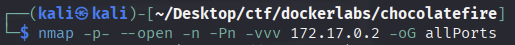
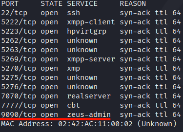
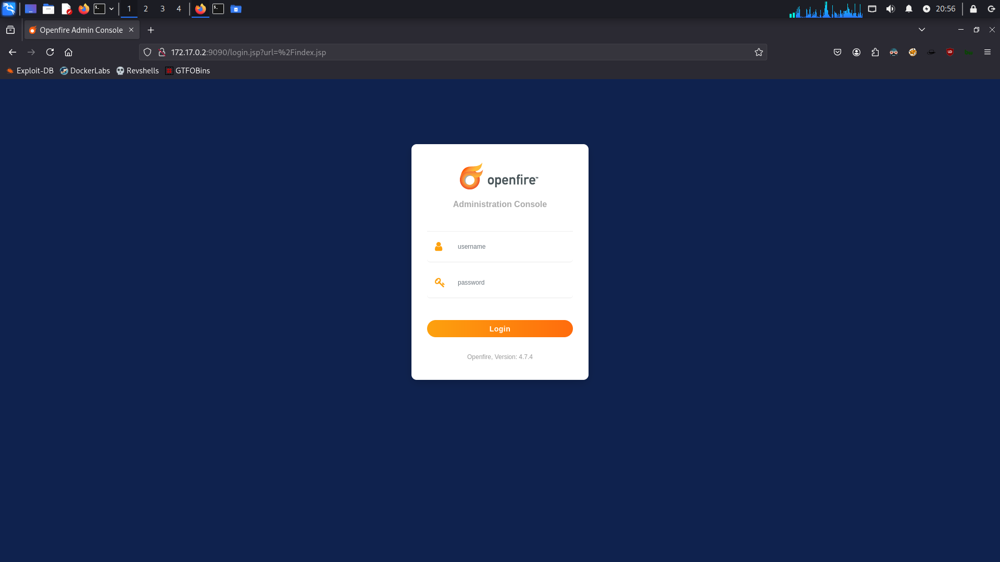
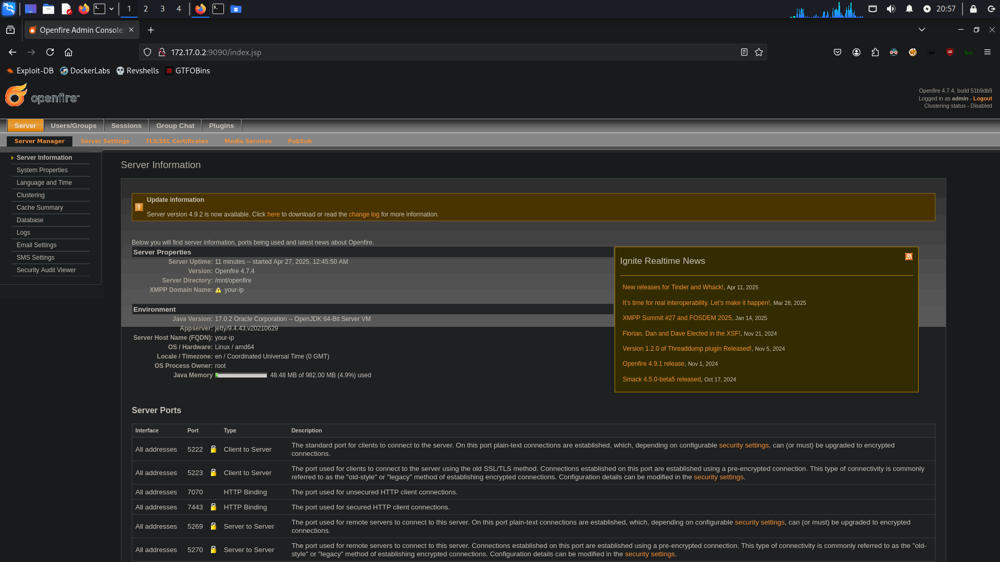
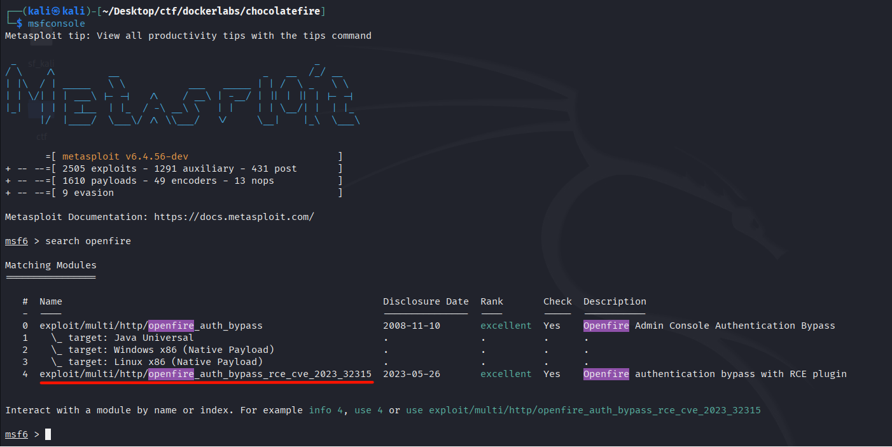
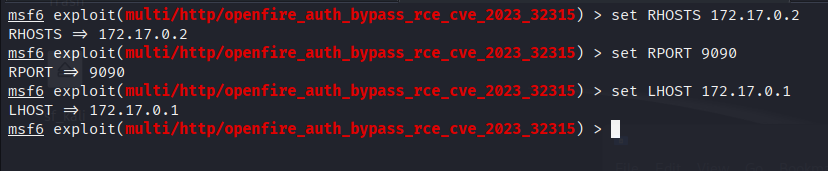
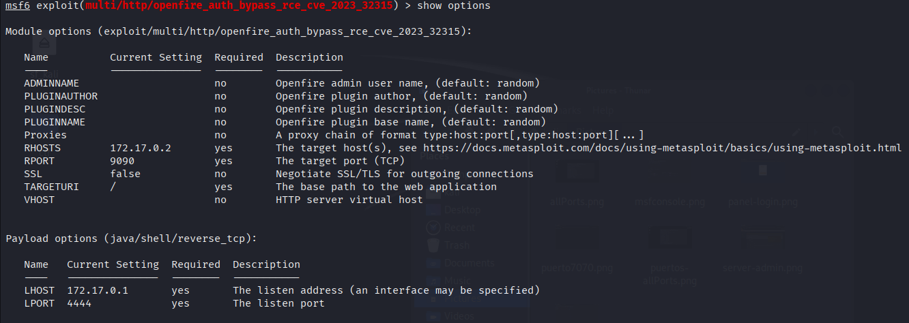
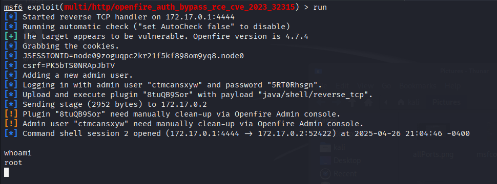

# ChocolateFire

Link del laboratorio -> [ChocolateFire](https://dockerlabs.es)

## Tags: 
`eJPTv2` `OpenFire` `Metasploit`

## Reconocimiento

Al haber desplegado el laboratorio haremos un escaneo completo de todos los puertos, para esto, emplearemos el comando `nmap -p- --open -n -Pn -vvv 172.17.0.2 -oG allPorts`.

Habremos percibido un puerto abierto un tanto curioso, el cual es el <b>9090</b>, llamado "<b>zeus-admin</b>".

## Página web

Probamos si este está alojando una página web ingresando a `172.17.0.2:9090`. Al ingresar, nos topamos con un panel de login de un tal servicio "openfire".

He intentado ingresar con las credenciales `user: admin password: admin` y me ha dejado ingresar.

He ojeado un poco y por aquí se pueden hacer cosas, pero a nosotros no nos interesan estos metodos, ya que, nuestro objetivo, como nos ha recomendado Mario (El creador de la máquina) es hacer intrusión con Metasploit.

## Intrusión con Metasploit

Ejecutaremos Metasploit y buscaremos un exploit para el servicio "openfire". Utilizaremos el que tiene plugin RCE.

Luego, declararemos las siguientes variables:

Dejando así las opciones del exploit:

Corremos el exploit y ya nos abre una sesión <b>root</b>.

